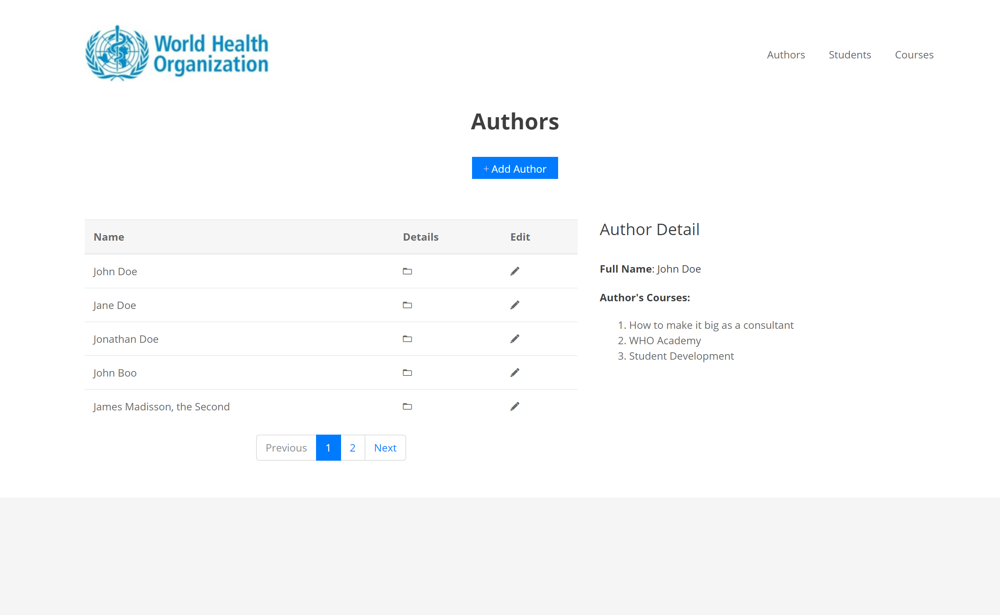

# WHO – Full Stack Developer Challenge

The challenge was to write a small web application to manage a list of Courses. Each course has a 
name and an author. The test consists of two parts, a RESTful API as the backend and the JavaScript 
based frontend application.

## Project Structure

The project directory structure is made up of two separate applications: 
* `WHO_Academy_Project_Backend`: A RESTful API backend application to be consumed by a client app.
* `WHO_Academy_Project_Frontend`: A frontend client app that consumes the RESTful API.

## Technologies

### Backend `WHO_Academy_Project_Backend`

The backend RESTful API is developed using the following stack:
* [Spring Boot](https://spring.io/projects/spring-boot)
* [H2 Database (embedded database)](https://www.h2database.com)

#### Requirements
* [Java 8+](https://www.java.com/en/download/)

### Frontend `WHO_Academy_Project_Frontend`

The frontend client is a JavaScript application using [React](http://reactjs.org) library.

#### Requirements
* [NodeJS](https://nodejs.org/)
* [NPM](https://www.npmjs.com/)

## Installation

### Backend `WHO_Academy_Project_Backend`

* While inside the backend application directory, open a terminal and type `./gradlew bootRun` in
Unix based operating systems or `gradlew bootRun` in Windows.
* First time installation will take a few minutes to start the server as dependencies are downloaded
and the project is built.

### Frontend `WHO_Academy_Project_Frontend`
* In the frontend application directory, open a terminal and type `npm install`, if downloading the
source files for the first time. This downloads the necessary dependencies.
* After `npm` downloads the dependencies, type `npm start` to start the server.
* Open `http://localhost:3000` in your browser to access the client application.

## Screenshot

